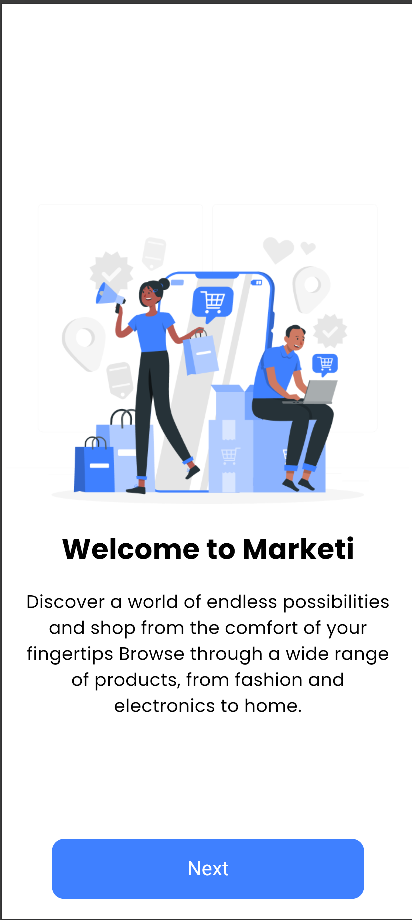
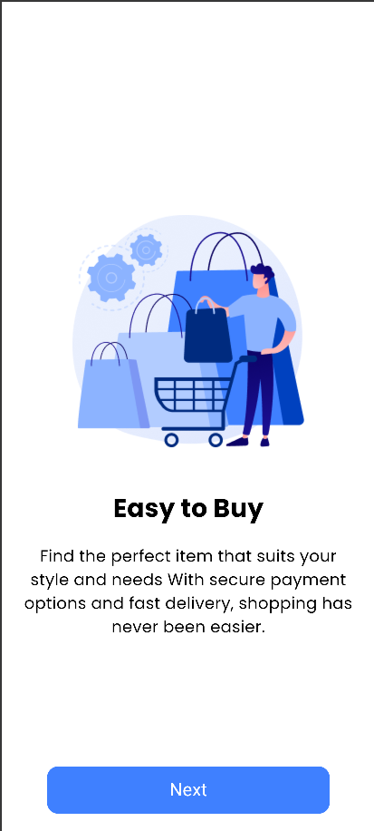
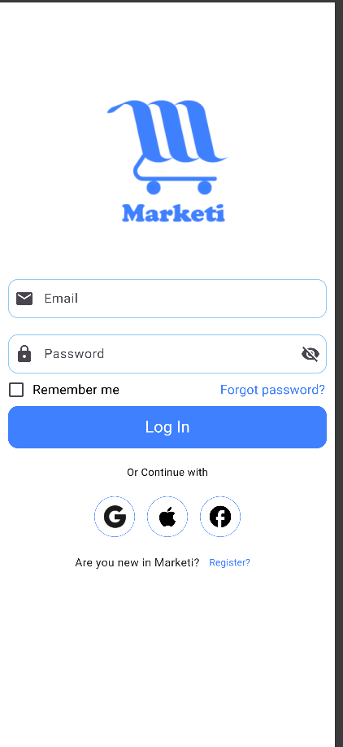
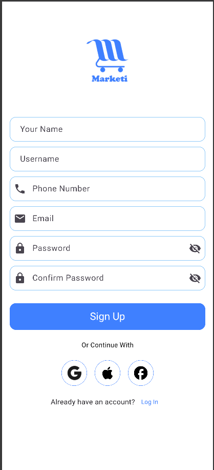
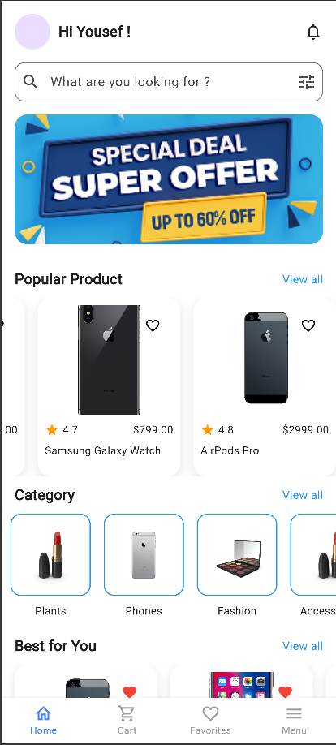

# E-Commerce App

## Table of Contents
- [Features](#features)
- [Dependencies](#dependencies)

## 📸 Screenshots

### Splash Screen

---

### Onboarding Screens

<table>
  <tr>
    <td></td>
    <td></td>
    <td></td>
  </tr>
</table>

---

### Authentication

<table>
  <tr>
    <td></td>
    <td></td>
  </tr>
</table>

---

### Home Screen

## Features

- **Authentication:** Secure sign-up, login, and user authentication via Firebase.
- **Product Listings:** Display a list of products with filtering and search capabilities.
- **Cart Management:** Add, remove, and view items in the shopping cart.
- **User Profile:** Allows users to manage their personal information and addresses.

## Dependencies

The project relies on the following key dependencies, each serving a specific purpose:

- **`flutter_native_splash`**: Adds a splash screen to your app for Android and iOS.
- **`flutter`**: The core Flutter SDK required to build the application.
- **`cupertino_icons`**: Provides iOS-style icons for your app.
- **`go_router`**: A routing package for Flutter to handle navigation.
- **`shared_preferences`**: Stores simple key-value pairs on the device, useful for settings or caching.
- **`dio`**: A powerful HTTP client for making API requests.
- **`flutter_bloc`**: Implements the BLoC pattern for state management in Flutter apps.
- **`equatable`**: Makes comparing objects in Dart easier and reduces boilerplate in BLoC states.
- **`flutter_screenutil`**: Helps in building responsive layouts for different screen sizes.

